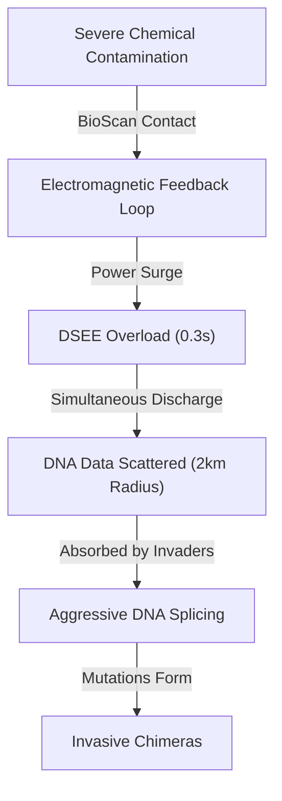

# 🌿 GENOMORPH — PROLOGUE
> *"Before you can save it, you have to understand what you lost."*

---

## 📋 Table of Contents
1. [The World Before](#1-the-world-before)
2. [The Collapse](#2-the-collapse)
3. [Dr. Alistair Sterling](#3-dr-alistair-sterling)
4. [The GenoMorph Suit](#4-the-genomorph-suit)
5. [The Volunteer](#5-the-volunteer)
6. [The First Test Run](#6-the-first-test-run)
7. [The Catastrophic Failure](#7-the-catastrophic-failure)
8. [Where We Begin](#8-where-we-begin)
9. [Prologue Cutscene Script](#9-prologue-cutscene-script)

---

## 1. The World Before

There was a time — not long ago, not in living myth, but within the last generation — when the region was alive.

Back then, four distinct ecosystems thrived side by side:
- **The wetlands** were a noisy chorus of frogs calling across still water, herons wading at dawn, and mudfish threading through ancient root systems.
- **The rainforest canopy** grew so dense that sunlight could only filter down in broken columns.
- **The coral reefs** glittered with constant movement under the waves.
- **The mountain summits** rose cold and permanent, their slopes home to the last wild Tamaraw—the rare dwarf buffalo found nowhere else on Earth.

It was not a pristine wilderness untouched by humans. People lived in it, beside it, because of it. They fished, farmed, traveled through it. The balance was not perfect. But it held.

Then, within a span of decades, the holding stopped.

---

## 2. The Collapse

No single disaster caused it. That is the hardest part to understand — and the most important.

It was **compounding**. Each damage made the next one easier.

### 🐸 Level 1 — The Wetlands

#### 🏭 Industrial Runoff
Factories built along river tributaries discharged untreated waste directly into waterways. Agricultural pesticides and fertilizers followed the same routes. Heavy metals settled into wetland sediment. Fertilizer overload triggered algal blooms — blooms that consumed all the oxygen in the water when they died, suffocating everything below the surface in a process called **eutrophication**.

#### 🐟 Invasive Species
They came through the same channels that trade always opens. Ships carrying ballast water released non-native fish. Agricultural programs introduced fast-breeding creatures meant to solve one problem and created several worse ones. Ornamental animals escaped into wild waterways. With no natural predators, their populations exploded. Native species — slower-reproducing, more specialized, adapted to a stable ecosystem rather than a destabilized one — could not compete.

### 🦅 Level 2 — The Rainforest

#### 🪵 Deforestation
Logging roads cut through the rainforest canopy, breaking it apart. Without continuous tree cover, the forest could not regulate its own temperature or humidity. Fruiting cycles collapsed. Seed-dispersing birds lost their corridors. Trees stopped being replaced. The forest began to fragment — not disappear all at once, but shrink, thin, and isolate, until populations of native animals became stranded on ecological islands surrounded by cleared land.

### 🦈 Level 3 — The Coral Reef

#### 🌊 Ocean Acidification
Carbon absorbed by the ocean had been quietly lowering the pH of reef waters for decades. Coral bleaching — the mass death of the microscopic algae that give reefs both their color and their nutrition — accelerated. A reef that had taken thousands of years to build began whitening and crumbling within years.

### 🐃 Level 4 — The Highland Mountains

#### ⚡ E-Waste
Old electronics, shipped from wealthier nations for "recycling," were dumped illegally in mountain regions. Heavy metals leached into highland soil and water. The final intact wilderness — the cold summits where the Tamaraw retreated from lowland pressure — became contaminated from above.

> **The ecosystem did not fall. It was pushed, piece by piece, until falling was inevitable.**

---

## 3. Dr. Alistair Sterling

**Dr. Alistair Sterling** is not a field scientist. He is quick to say so.

He is a **biomedical engineer and geneticist** who spent the first twenty years of his career in pharmaceutical research — reading genomes, designing drug delivery systems, understanding how biological material could be stored, stabilized, and precisely introduced into a living body. He is brilliant with machines, and admittedly uncomfortable with mud. 

Yet, beneath his clinical demeanor lies a deep, lifelong love for nature—a connection to the wild he had long suppressed under layers of lab coats and spreadsheets. 

The death of the ecosystem broke his heart. He had watched it happen the way that most people watch slow disasters: with a mixture of grief and helplessness, believing the scale of the problem dwarfed anything an individual could do.

What changed him was the realization of what would happen if he did nothing. Looking at the rapidly expanding dead zones, he understood a simple truth: the plants and animals are not just residents of the land—they *are* the land. Without them, the ecosystem has no memory of how to function.

This realization reawakened his quiet, suppressed love for the wild. Eager to help and determined to apply his expertise where it mattered most, Sterling turned away from pharmaceutical research, went home to his workshop, and started designing.

### What He Believed
Sterling's central conviction — the principle behind everything he built — was this:

> **The ecosystem already knows how to fix itself. The species that evolved here are perfectly adapted to restore the balance, if given the chance. The missing piece is not knowledge or force. It is presence.**

The native animals, if restored to sufficient population, would do the work: filter the water, disperse seeds, control invasive populations, cycle nutrients through decomposition. Every species is a tool. Every adaptation is a solution.

The problem was that there were not enough of them left — and the environment had become too hostile for them to return on their own.

What he needed was something that could go in first. Clear the path. Restore enough stability that the surviving native animals could begin to rebuild.

---

## 4. The GenoMorph Suit

It took Sterling **eleven years** to build the first working prototype.

The **GenoMorph** is a full-body adaptive suit — form-fitting, layered, and laced with synthetic biological interface systems. At its core is a **DNA Storage and Expression Engine (DSEE)**: a system that can:

1. **Extract** a viable DNA sample from any animal — living or recently deceased
2. **Store** that genome in a compressed biological matrix within the suit's memory
3. **Express** the stored genome on the wearer's body — triggering a controlled, temporary biological transformation into that animal form

The transformation is not theatrical. It is **total and physical**. The wearer's bone structure and musculature reconfigure, their respiratory system adapts, and their senses expand to perceive the world exactly as the animal does—whether through echolocation, thermal sensing, or lateral line detection. 

The suit safely manages the entire transition cycle, returning the wearer to their human baseline without tissue damage or lasting physical strain.

### Key Systems

| System | Function |
|---|---|
| **DSEE (DNA Storage & Expression Engine)** | Core transformation engine — stores up to 12 active genomes |
| **BioScan Array** | Surface sensors that read environmental biological data in real time |
| **Genome Purification Module** | Filters corrupted or hybrid DNA sequences before storing them |
| **Adaptive Armor Layer** | Hardened outer shell that reconfigures with each transformation |
| **Suit Radio (SR-7)** | Encrypted two-way communication linked directly to Sterling's lab |
| **Neural Interface** | Translates animal sensory input into information the human brain can process |

### The Limitation Sterling Couldn't Solve
The suit's DSEE requires **clean, uncorrupted DNA** to function. DNA from invasive species — and especially from Invasive Chimeras, whose genomes are already a chaotic splice of multiple animals — is unreadable garbage to the system. It will not accept it.

The only way to add a new native form is to extract DNA from a *native animal that still carries clean, stable genomic data* — or to purify corrupted data recovered from a Chimera that absorbed native DNA into its tissue.

This limitation is the reason the suit can only expand its library **by winning**.

---

## 5. The Volunteer

Sterling did not look for a soldier. He did not want one.

The work ahead required patience, ecological sensitivity, and the ability to follow complex biological instructions under pressure — not a combatant's instinct to destroy first. The ecosystem had already been damaged by forces that approached it as a resource to be taken. He needed someone who understood it as a system to be restored.

He put out a call through the regional nature conservation networks. The listing was unusual:

> *"Seeking one individual for high-risk environmental field work. Requires physical fitness, comfort in all terrain types, and genuine investment in ecological restoration. No prior combat training required. Full training provided on-site. Duration: open-ended. Compensation: negotiable. Risk level: significant. If you love this land: apply."*

**The player** responded.

### What We Know About the Volunteer
The Volunteer is not defined by backstory. They are defined by the choice to show up.

What we know:
- They grew up near the region — they have personal memories of what it looked like before
- They are not naive about the danger (Sterling is clear about it from the first meeting)
- They are skilled outdoors: tracking, swimming, climbing, wilderness navigation
- They are not trained in combat — but they learn fast

### Why This Person — The Biological Reason
Sterling did not select the Volunteer based on their application alone. Every serious applicant underwent a quiet second screening they were never told about: a DNA compatibility test, administered through a simple blood sample collected at the first in-person meeting under the pretense of a routine health check.

The GenoMorph's **Neural Interface** — the system that translates animal sensory input into information a human brain can process — does not work with just anyone. The transformation is total and physical. For the suit to safely rewrite the wearer's sensory architecture without causing permanent neurological damage, the wearer's genome must carry a specific cluster of traits: high neural plasticity, an unusually adaptive sensory cortex, and a rare variant of the gene that governs the body's tolerance for rapid biological change. Sterling had identified this genetic profile years earlier during his pharmaceutical research and had quietly built the suit around it.

Out of everyone who applied, only the Volunteer matched.

Sterling knows this. He has never told them directly — he is not sure how to explain that they were chosen, in part, because of something written into their cells before they were born. But he carries it. It is one of the reasons he stays on the radio. It is the closest thing he can offer to an apology for the weight he has placed on someone else.

**Why Sterling Cannot Go Himself:**
Sterling has tested his own compatibility. He knows the answer. His genome does not carry the required profile — his neural architecture is too rigid, too specialized in one direction. He spent twenty years training his brain to think in the precise, analytical language of laboratory science. The suit would not be able to translate the animal senses into anything his mind could process without causing serious harm. He would go in and come back broken, or not come back at all.

This is the part he does not say out loud, but it shapes everything:

> *He built a suit he cannot wear. So he found the one person who could.*

Sterling meets the Volunteer once in person before the test run, in his lab. He shows them the suit. He explains the transformation. He tells them the honest version:

> *"I don't know everything that will happen when you put this on. The prototype has worked in controlled conditions. The field is not a controlled condition. I will be with you the entire time through the radio. But you will be the one in the suit."*

What he does not say — but what the Volunteer will eventually learn — is the rest of it:

> *"And I will be with you on the radio because I cannot be anywhere else. Because the suit was never going to fit me. And you were always going to be the one."*

The Volunteer says yes.

---

## 6. The First Test Run

### The Plan
The test run is not meant to be the real mission. It is a **calibration deployment** — the first time the suit is used in actual field conditions rather than a lab environment.

Sterling's plan for Test Run 1:
- The Volunteer puts the suit on and enters the outer edge of the Polluted Wetlands
- The suit's BioScan Array collects environmental data — baseline toxin readings, dissolved oxygen levels, invasive population density
- The DSEE tests a single transformation: **Small Native Frog** — the smallest, least complex genome in the database, chosen specifically because it is low-risk
- The Volunteer holds the Frog form for 60 seconds, then transforms back
- Sterling records the data. They debrief. They plan the actual mission.

### What Was Loaded Into the Suit
Before the test run, Sterling had spent months collecting DNA samples from native species across the region. The DSEE was loaded with **twelve stored genomes** — one for each of the native animals he had managed to safely sample:

- 🐸 Small Native Frog *(active — selected for Test Run 1)*
- 🦅 Rufous Hornbill
- 🦈 Blacktip Reef Shark
- 🐃 Tamaraw
- And eight additional native species samples collected for future phases

These were years of fieldwork, careful extraction, and purification. The database represented an irreplaceable archive of biological data from species whose wild populations were critically low.

### The Test Run Begins
The Volunteer enters the wetland at the designated entry point. The suit activates. Environmental readings come in cleanly. Sterling, in his lab, monitors the data stream.

The Frog transformation initiates.

Everything is working.

---

## 7. The Catastrophic Failure

No one knows exactly what caused the failure. Dr. Sterling's post-incident analysis suggests a rapid chain reaction:

### ⚡ The Failure Sequence
1. **Severe Toxin Exposure:** The suit's BioScan Array contacted industrial compounds far more concentrated than any tested in lab conditions.
2. **Electromagnetic Feedback:** This contact triggered a massive feedback loop through the suit's power cell.
3. **System Overload:** The power surge hit the DSEE (DNA Storage and Expression Engine), overloading the system in 0.3 seconds.
4. **Energy Discharge:** The DSEE did not simply shut down; it discharged all twelve stored native genomes as a burst of raw biological energy.
5. **DNA Scattering:** The biological data scattered outward across a two-kilometer radius.
6. **Invasive Splicing:** Local invasive species, known for their aggressive and absorptive biology, absorbed the fragments of native DNA.
7. **Chimera Creation:** The genetic merging mutated the invasives into **Invasive Chimeras**—unstable, highly aggressive creatures holding pieces of the native genomes.

### What Was Left in the Suit
Nothing. The DSEE was completely wiped. Every stored genome was gone.

The suit itself was still functional — structurally intact, radio operational, armor systems online. But the only transformation that remained was the one that had already been initiated at the moment of the surge:

**🐸 Small Native Frog.**

The transformation was mid-cycle when the failure hit. The suit locked it in place as a failsafe — a half-completed transformation held stable to protect the wearer from the cascade. It is the weakest form. The most fragile. The one Sterling had specifically chosen because it presented the lowest risk.

### Sterling's Radio Call
The radio crackles back to life 47 seconds after the surge.

> *"Volunteer. Can you hear me? Please respond."*

A pause. Then:

> *"I'm here. I'm— I'm a frog."*

> *"I know. I'm sorry. Just — stay still. I'm trying to read what's left."*

A longer pause. The sound of frantic keystrokes. Sterling's voice comes back unsteady.

> *"The DSEE didn't just fail. It discharged. All twelve genomes went out as raw biological energy — I have no idea where they landed. They could be in the water, the soil, the air. They could be in anything out there that was close enough to absorb them."*

> *"What does that mean?"*

> *"It means whatever is living in that wetland right now — I don't know what it is anymore. The surge happened fast. Biology doesn't wait. If something absorbed even a fragment of that data, it won't look or behave like anything normal. You need to be careful. You need to be very careful."*

> *"So what do I do?"*

Sterling doesn't answer immediately. When he does, his voice is quieter — not calm, but honest.

> *"The data is still out there somewhere. It has to be. Energy doesn't disappear — it just moves. Your suit's Purification Module is still active. If you can find what absorbed those genomes and get close enough, the suit might be able to read and recover the data. But I can't tell you what you'll find. I don't know yet. I'm still running the numbers."*

> *"Starting from a frog."*

> *"...Starting from a frog. I'm sorry."*

---

## 8. Where We Begin

**The player wakes up in a toxic swamp. They are a frog.**

Around them:
- Brown, stagnant water stretching in every direction
- Dead reeds. Floating fish. Toxic sludge pools steaming in the dim light
- The distant sound of something massive moving in the deeper marsh
- A concrete highway visible far at the edge of the wetland — grey and impassable, rising above the treeline

The suit's display is minimal. Only one form is listed in the DSEE. Only one transformation is available.

The radio crackles.

> *"Volunteer. Your suit is locked to Frog form for now. The data's out there. Find it."*

The wetland is dying. The Chimera is somewhere in the deep marsh. The food chain is broken at every link. The region — wetlands, rainforest, reef, and mountain — is collapsing.

And somewhere in the bodies of four massive Chimeras is the DNA of the animals that used to keep it alive.

**The mission was supposed to be a test run. It is now something else.**

> *Transform and Thrive. Keep the Wild Alive.*

---

## 9. Prologue Cutscene Script

*The following is the full cutscene script for the game's opening. It plays before the player gains control.*

---

**[FADE IN — ARCHIVAL FOOTAGE STYLE]**
*Slow, amber-toned images: a thriving wetland at golden hour. Herons in still water. A frog perched on a lily pad. Small fish darting in clear shallows. A Hornbill calling from a high branch.*

**DR. STERLING (V.O.):**
*"There is a word ecologists use: keystone. A keystone species is one that holds everything else in place — whose presence keeps the balance, whose absence causes collapse."*

*[Cut. Images shift: the same places, degraded. Brown water. Dead trees. Concrete cutting through forest. Bleached reef.]*

**DR. STERLING (V.O.):**
*"This region lost most of its keystones. Not at once. Quietly. Over decades. The way a wall loses its mortar."*

**[HARD CUT — INTERIOR, LAB — NIGHT]**
*Sterling at a workbench, surrounded by monitors and biological equipment. He is older than he looks in photographs — tired in the way that sustained, solitary work makes a person tired. He looks at the camera.*

**DR. STERLING:**
*"My name is Dr. Alistair Sterling. I am a geneticist and biomedical engineer. I have spent the last eleven years building something that I believe — that I have to believe — can help."*

*[He holds up a component of the suit — a dense, articulated panel of the adaptive armor layer.]*

**DR. STERLING:**
*"The ecosystem already knows how to fix itself. I just need to give it a way back in."*

**[CUT — MONTAGE: SUIT ASSEMBLY]**
*Time-lapse of the GenoMorph suit being built, tested, refined. Lab tests — a suited figure briefly flickering between human silhouette and the outline of a frog. Sterling watching data streams, writing notes, discarding designs, starting over.*

**[CUT — EXTERIOR, DEGRADED WETLANDS BORDER — DAY]**
*We see the Volunteer from behind, standing at a wire fence overlooking the ruined, brown wetlands. They are holding Sterling's recruitment listing. Their posture is still, carrying a quiet grief that hardens into resolve. They fold the paper and turn away from the dead water, walking with purpose.*

**DR. STERLING (V.O.):**
*"I found the right person. Someone who knew this land. Someone who wanted it back."*

**[CUT — EXTERIOR, LAB ENTRANCE — DAY]**
*The Volunteer arrives at Sterling's lab. Sterling meets them at the door. A brief, firm handshake. They walk inside together.*

**[CUT — INTERIOR, LAB — LATER]**
*Sterling shows the Volunteer the suit hanging in its storage frame. He explains the transformation. Then he pauses — the kind of pause that means there is more.*

**DR. STERLING:**
*"There is something else I need to tell you. About why it's you specifically."*

*[He pulls up a genomic display on one of his monitors. Two DNA profiles side by side — one labeled with the Volunteer's name, one labeled simply: AS.]*

**DR. STERLING:**
*"The suit's Neural Interface — the system that makes the transformation survivable — it requires a very specific genetic profile. High neural plasticity. An adaptive sensory cortex. A tolerance for rapid biological change that most people simply don't have."*

*[He points to the second profile — his own.]*

**DR. STERLING:**
*"I tested myself first. Years ago, before I even finished building it. My genome doesn't carry it. I spent too long training my brain to think in one direction. The suit would tear my mind apart trying to speak to it in a language it has already forgotten how to hear."*

*[Beat. He closes the display.]*

**DR. STERLING:**
*"You were the only applicant who matched. Which means the suit was always going to need you. I just needed to find you."*

*[The Volunteer looks at the suit for a long moment. Then back at Sterling.]*

**VOLUNTEER:**
*"When do we start?"*

**DR. STERLING:**
*"Tomorrow morning. Test run only. 60 seconds in Frog form, then we debrief."*

**[CUT — EXTERIOR, WETLAND EDGE — DAWN]**
*The Volunteer, now in the suit, stands at the edge of the wetland. The suit is sleek and dark, its display panels glowing faintly green. The wetland spreads before them — murky, chemical-smelling, already visibly damaged.*

*Sterling's voice comes through the radio earpiece.*

**DR. STERLING (RADIO):**
*"BioScan readings are coming in. The contamination is higher than I expected — but within tolerance. Initiating Frog transformation on your mark."*

**VOLUNTEER:**
*"Mark."*

*[The suit shimmers. The transformation begins — smooth, precise, the Volunteer's silhouette shifting into the compact shape of a native frog.]*

*[A half-second of stillness.]*

*[Then — the power surge. A blinding burst of white light, followed by a violent electrical crackle. A warning klaxon sounds briefly before dying.]*

*[SLOW MOTION: Twelve distinct, brilliant pulses of golden light erupt from the suit's chest piece, scattering outward across the dark wetland like shooting stars. The DNA database is dispersing. Gone.]*

*[The camera drops violently to frog-height. The world undergoes a jarring perspective shift: towering reeds look like redwoods, toxic sludge drops are the size of boulders, and the horizon is a distant, blurry line. A heavy, chemical-laden dampness fills the air. The player's breath is shallow and rapid—the breathing of a panicked, small animal.]*

*[The Volunteer's hands, now webbed, dark green, and tiny, press into the mud. They try to stand, but their new center of gravity is too low; they wobble and tumble onto their side in the swamp mud.]*

*[Silence, save for the rhythmic, foreign sound of the Volunteer's own wet throat pulsing.]*

*[Then, the distant, water-muffled roar of something massive awakening deep in the swamp. The sound vibrates directly through the mud under the Volunteer's belly.]*

**DR. STERLING (RADIO):**
*[Heavy static. Dr. Sterling's voice is laced with genuine panic.]*
*"Volunteer! Volunteer, do you copy? The biometric stream is haywire—please respond!"*

**[PAUSE — TWO SECONDS]**
*We hear the Volunteer's breath, high-pitched and strange. They look down at their webbed limbs.*

**VOLUNTEER:**
*[Voice trembling, slightly muffled]*
*"I'm here. I'm... I'm down in the mud. Sterling, I'm a frog. I'm literally a frog."*

**DR. STERLING (RADIO):**
*"I know. I'm sorry. Just — stay still. I'm trying to read what's left."*

*[The sound of frantic keystrokes through the radio static.]*

**DR. STERLING (RADIO):**
*"The DSEE discharged. All twelve genomes — gone from the suit. Released as raw biological energy. I don't know where they landed. The water, the soil... anything that was close enough could have absorbed fragments. Whatever is living in that wetland right now — I don't know what it is anymore."*

**VOLUNTEER:**
*"What do I do?"*

*[A long pause. When Sterling speaks again, he sounds quieter — not calm, but honest.]*

**DR. STERLING (RADIO):**
*"The data is still out there somewhere. It has to be. Your suit's Purification Module is still active — if you can find what absorbed those genomes and get close enough, the suit may be able to read and recover what's left. But I can't tell you what you'll find out there. I don't know yet."*

**VOLUNTEER:**
*"Starting from a frog."*

**DR. STERLING (RADIO):**
*"...Starting from a frog. I'm sorry."*

*[Beat.]*

*"Your suit is locked to Frog form for now. Go carefully, Volunteer. Whatever is out there — it isn't ordinary anymore."*

**[TITLE CARD FADES IN]**

> **🌿 GENOMORPH**
> *Transform and Thrive. Keep the Wild Alive.*

**[FADE OUT TITLE CARD — BLACK]**

**[FADE IN — GAMEPLAY]**
*A heavy droplet of chemical-laced rain falls from a giant reed directly toward the player. The suit HUD flashes: **[SPACEBAR] to Leap**.*

*The player leaps just in time. The toxic droplet splatters behind them, burning a patch of grass. The HUD flashes: **[MOUSE 1] to Feed**. An invasive Mosquito flies close. The player clicks, their tongue snapping out to catch the bug, instantly healing the minor armor damage from the toxic splash.*

*Sterling's voice crackles back in over the radio.*

**DR. STERLING (RADIO):**
*"Okay... suit telemetry is stable. Your basic biological systems are functioning. You need to get moving, Volunteer—something big is heading towards your signature."*

**[PLAYER GAINS CONTROL]**

---

> **📝 Design Note:**
> The prologue serves three functions simultaneously:
> - **Emotional investment** — the player understands what was lost before they start recovering it
> - **Mechanical setup** — the logic of why transformations must be earned, not given, is established without a tutorial
> - **Scientific framing** — keystone species, trophic cascades, and ecosystem interdependence are introduced as *narrative concepts* before they become *game mechanics*, so the player absorbs the biology through story first
>
> The Volunteer's personality is deliberately minimal at this stage. The player will define them through choices. The prologue's job is to put them in the swamp with a reason to care — not to tell them who they are.
